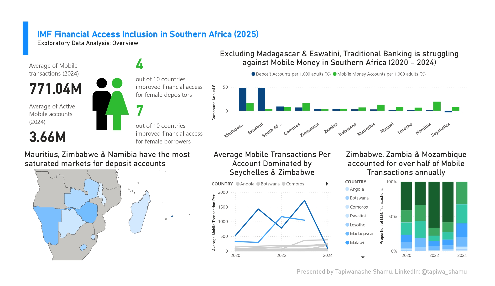

# IMF Financial Inclusion Analysis of Southern Africa (2025) 

## EXECUTIVE SUMMARY

The **International Monetary Fund (IMF) Financial Access Survey (FAS)** is a global dataset that tracks **access and usage of financial services**. Since its launch in 2009, it has collected supply-side data from financial service providers, producing key indicators that guide policy decisions, business strategies, and international benchmarking for financial inclusion.  

This project relies on SQL analysis to explore **financial access trends in Southern Africa from 2020–2024**, analyzing how it evolved across **14 countries** on a dataset containing 195k records. This was prepared independently for 2 weeks to clean and analyse data in SQL, with dashboards built using Power BI to visualise trends related to the selected regions and periods.
The objective is to **identify key shifts, disparities, and opportunities - as well as provide actionable recommendations** for financial executives, policymakers, and development stakeholders, focusing on investment strategies in Southern Africa.  

### Project Themes & Metrics
The analysis focuses on **five key areas**:

| Focus Area | Questions | Key Metrics |
|-------------|--------------|--------------|
| **1. Market Expansion** | Which sectors are most dominant between Traditional Banking vs Mobile Money?  How much of the changes can be explained by population growth per country? | - 5Y Compound Annual Growth Rate  - R-squared model (regression analysis) |
| **2. Gender Parity** | Has financial inclusion improved or worsened for female Depositors & Borrowers? | - Gender Parity Index (GPI)  - Average Annual Parity Improvement  - Projected Years to Parity |
| **3. Banking Infrastructure Efficiency** | Which markets achieved higher financial inclusion with fewer touchpoints? | - Depositors per 100,000 adults  - Total infrastructure per 100,000 adults (ATMs, branches, agents)  - Efficiency Ratio (Depositors per Infrastructure point) |
| **4. SME Credit Trends** | What's the rate at which SME Lending has improved in the region? | - Loan-to-Deposit Ratio (LDR) |
| **5. Mobile User Maturation** | Are registered users becoming more active over time?  Which regions have the most activity? | - Proportion of Registered accounts with active status   Proportion of SADC mobile transaction volume per country|

**Countries assessed:**  
*Angola, Botswana, Comoros, Eswatini, Lesotho, Madagascar, Malawi, Mauritius, Mozambique, Namibia, Seychelles, South Africa, Zambia, Zimbabwe.*  
**Time frame:** *2020–2024*

### Data Analysis Process (Quality Checks, Cleaning & Final Data Structure) 

Before the data cleaning and analysis process, checks were conducted in MySQL to assess the quality of the data for Southern Africa, as well as gain familiarity of the dataset. The following results were found from the data quality tests:

 

To review the SQL queries utilised to inspect and perform the data quality checks, [click here.](imf_data_quality_script.sql)

Given the state of the results, rigorous data cleaning was conducted to remove duplicates and redundant columns, fill in blank information, split up columns and standardise the data. The queries used to clean and prepare the data for analysis can be found [here.](imf_data_cleaning_script.sql) 

Next was the data analysis stage, where the key questions under the Project Themes & Metrics section were referenced, as well as the metrics required to surface the key insights. The SQL script for this section can be found [here.](imf_data_analysis_script.sql) 

Finally, the results of the analysis were exported as CSVs, imported into Power BI and connected together via a Data Modelling process, as shown by the following Entity-Relationship Diagram:

***Please Note:** Exporting SQL results to CSV is not considered best practice, but in this case it was done for the sake of project visibility*

The project then concluded at the visualisation stage, where the results from SQL data were transformed into dashboards with line charts, cards and map visuals for effective insights. 

### Overview of Findings

The findings reveal a **regional shift towards mobile money channels**, **stagnant gender parity**, and **strained banking infrastructure** in several markets.  
While mobile adoption surged during that period, **active user engagement declined post-COVID-19**, suggesting potential market fatigue or policy misalignment.

### 1. Market Expansion: Traditional Banking vs. Mobile Money
- Except for **Madagascar** and **Eswatini**, the CAGR of deposit accounts was below or only marginally above mobile money account growth — signaling traditional banks’ loss of market share to digital platforms.  
- **Zimbabwe**, **Seychelles**, and **South Africa** showed weak correlations between deposit account growth and population growth, implying that **macroeconomic or policy factors**, rather than demographics, drove expansion.

### 2. Gender Parity
- Gender Parity progress remained **limited**. Between 2020–2024, average annual change was **-2% for depositors** and **+1% for borrowers**.  
- As of 2024, **women represent ~75% as many depositors and borrowers as men**, underscoring persistent barriers to equitable financial access.

### 3. Banking Infrastructure Efficiency
- **Mauritius, Zimbabwe, and Namibia** have the most saturated banking markets, each exceeding **2,000 depositors per banking touchpoint**.  
- **Mauritius** stands out — every adult holds at least **two deposit accounts**, but infrastructure growth lags behind.  
- **Botswana** and **Madagascar** experienced rapid **infrastructure expansion**, particularly through **agent and ATM growth**.

### 4. SME Credit Trends
- The regional **median Loan-to-Deposit Ratio (LDR)** was **0.7 in 2024**, meaning $0.70 was lent for every $1 deposited.  
- **Namibia**’s LDR of **2.54** reflects **aggressive lending beyond deposits**. Despite liquidity concerns, Namibian banks are reported to be stable and strongly supported by central bank oversight.

### 5. Mobile User Maturity
- While registered accounts rose sharply, **active accounts remained stagnant after 2022**, signaling **lower engagement**.  
- This may be due to the effects of the post-pandemic period as restrictions were lifted, high transaction costs or digital engagement fatigue across several markets

### Recommendations
- Banks should pivot toward mobile money partnerships and interoperable platforms to remain competitive, particularly in underserved markets.
- Regulators and institutions should review financial inclusion frameworks, incentivize women-led enterprise funding, and ensure targeted lending programs.
- Focus investments in high-population, low-infrastructure markets (e.g., Madagascar) and saturated but underperforming systems (Namibia, Zimbabwe).
- Maintain LDR ratios within the 0.7–0.9 range to ensure liquidity and support SME sector growth sustainably.
- Encourage mobile activity through reduced transaction fees, loyalty programs, and simplified digital onboarding, especially in markets in need of recovery.

### Limitations & Assumptions of Analysis
- Data gaps may affect accuracy of insights.  
- The time period was limited to 2020–2024 for recency and manageability of the analysis.  
- South Africa’s 2024 data was unavailable.  
- Data entry inconsistencies from source agencies may have affected trend accuracy.  
- Broader global economic factors beyond COVID-19 were excluded for scope clarity.

---

## DEEP DIVE INSIGHTS AND RECOMMENDATIONS (FURTHER READING) 

### 1. Market Dominance: Traditional Banking or Mobile Money? 
 
***Note:** According to the IMF, Mobile Money is a financial service offered to its clients by a mobile network operator or another entity that partners with mobile network operators, **independent** of the traditional banking network.*

**Insights:**
- From 2020-2024, the Compound Annual Growth Rate (CAGR) of Bank Deposit Accounts per 1,000 adults reached a high of 48% in Madagascar and Eswatini, signalling a large rise of people creating bank accounts in these countries. However, the rest of the region has had a relatively slow improvement (at most 9%), the lowest being Seychelles with -3%, indicating a migration from banking services in the country.
- In contrast, the CAGR of Mobile Money Accounts per 1,000 adults has a narrower spread between countries, with 8 countries experiencing growth of at least 5%. This suggests a consistent growth of mobile money accounts across Southern Africa. 
- A side-to-side analysis reveals that traditional banking has a higher growth rate in only 4 of the 12 countries shown. This demonstrates the rising wave of mobile money as an alternative in the past 5 years, although this may have been due to the effect of Covid-19 restrictions. This largely affected banks, some of which relied on in-person banking processes,and thus gave mobile money operators a competitive advantage, as they are easier to set up and operate remotely.
- A linear regression analysis was done on each CAGR of deposit and mobile money accounts per country, with additional data from the World Bank Population Indicator. The results found that despite having steady growth rates, Seychelles, South Africa and Zimbabwe have the lowest correlation to population growth, meaning the rise/decline of deposit or mobile money accounts from 2020-2024 were most likely caused by other factors than demographics, perhaps major policy adjustments or economic growth. 

**Recommendations**
- The high banking growth in Eswatini and Madagascar may be due to efforts in expanding access to first time account owners. This may prove that outreach programs that focus on financial literacy and trust-building can yield strong results, and should be replicated in other countries. 
- There is a need for banking services to invest more in resources that expand mobile banking channels, partnering with mobile money operators to capture their customer base, allow smoother transfers and broader financial inclusion, and streamline processes that enable users to create accounts at a faster and more efficient rate. 
- Further analysis may need to be conducted to investigate the main drivers behind the growth (and decline) rates of deposit and mobile money accounts in Seychelles, South Africa and Zimbabwe. 

---
### 2. Gender Parity: Has financial access improved or worsened for women? 
  

**Insights:**
- As of 2024,the average Gender Parity Index of Southern Africa stood at 76.8% for Depositors, and 73.9% for borrowers. This means that on average, approximately 3 out of 4 women have as many bank deposit and loan accounts as men. In addition, at its current rate, Gender Parity is expected to be achieved in 14-15 years. 
- However, the pace at which this has improved over time has become stagnant. The average annual improvement rate for Depositors in SADC stood at - 2.2%, meaning less women are creating deposit accounts annually. For borrowers, the average rate is at 1.6%, signally a limited but steady improvement for female borrower access.
- The main driver for the dip in Depositor improvement is in Madagascar. With a population of over 30 million, the country experienced a high growth of Deposit accounts in the past 5 years, but majority of the new accounts are owned by males. This resulted in a sharp decline of their rate of improvement by -16.4%.
- In contrast, Zimbabwe's drive in lending programmes to female account holders had pushed up the regional average for borrower improvement, as they experienced an 18% annual increase in loan accounts owned by females, leading to a borrower parity of 120.8% in 2024. This means more women in Zimbabwe have loan accounts than their male counterparts by 20%.
- The summarised table for the trend in Gender Parity across countries is shown below:

| Country | Depositor Parity Trend| Borrower Parity Trend |
|-------------|--------------|--------------|
| **Angola** | Moderate Improvement (1.1%) | Stagnant/Declining (-6.9%) |
| **Botswana** | Fast improvement (2.3%) | Fast improvement (2.3%) |
| **Comoros** | Fast improvement (3.4%) | Fast improvement (3.6%) |
| **Lesotho** | Stagnant/Declining (-1.6%) | Moderate Improvement (1%) |
| **Madagascar** | Stagnant/Declining (-16.4%) | Stagnant/Declining (-1.5%)|
| **Malawi** | Moderate Improvement (1%) | Stagnant/Declining (-4.4%) |
| **Mauritius** | Stagnant/Declining (-0.1%) | Moderate Improvement (0.9%) | 
| **Namibia** | Stagnant/Declining (-6.8%) | Moderate Improvement (0.8%) | 
| **Seychelles** | Stagnant/Declining (-0.3%) | Fast Improvement (2.3%) | 
| **Zimbabwe** | Stagnant/Declining (-4.8%) | Fast Improvement (18%) | 

**Recommendations:**
- Countries with stagnating trends must review barriers to women’s access, such as collateral requirements, credit history policies, or legal constraints, and adopt more gender inclusive policies for national financial inclusion strategies, with the support of the central bank to reward financial institutions that demonstrate improved female outreach.
- Introduce incentive based savings products for women e.g. low fee accounts, group saving schemes, or matched savings programs, in order to mobilise efforts to regain demand amongst female clients.
- Replicate gender-focused credit programs such as micro-lending for women entrepreneurs, credit guarantee schemes, and capacity-building support for women-led SMEs.  

---
### 3. Infrastructure Trend: Which markets achieved higher financial inclusion with fewer physical touchpoints? 

***Note:** The Infrastructure Efficiency Ratio measures the number of Deposit accounts at each financial service outlet (i.e. a bank branch, ATM or agent). This can give guidance on the saturation of a market, its capacity of infrastructure to accommodate depositers, or its range of access in an area.* 

**Insights:**
- Mauritius, Zimbabwe and Namibia have the largest average volume of Depositors per touchpoint in 5 Years, with at least 2000 Depositors. Mauritius in particular has over 4000 per touchpoint, with each adult owning at least 2 accounts in the country. 
- However, unlike Namibia's efficiency ratio, which has grown proportionately with its growth of infrastructure, Mauritius and Zimbabwe's total infrastructure per 100,000 had stagnated since 2022, with little population growth experienced. This may reveal a strain of financial service outlets due to an overgrowth of depositors, or a limited coverage of access that's mostly reserved to urban areas. 
- Interestingly enough, despite having one of the lowest efficiency ratios, commercial banks in Botswana and Madagascar significantly expanded their infrastructural capacity during the pandemic period (2020-2022). Upon closer inspection, this was largely due to deployment of banking agents, a leaner and lower cost method to expand their reach across their countries, in place of traditional branches. This may have contributed to wider access coverage, as well as improved physical access and good customer experience. 

**Recommendations:**
- Investors must aim for underrepresented markets with a distributed network of bank services, or those with huge potential for growth such as Namibia, Botswana and Madagascar. 
- Mauritian banks must expand their respective brands to other regions, as their local branches are reaching a point of saturation (76 branches per 1000 km^2). 
- Banks in Namibia and Zimbabwe must replicate the efforts pushed in Botswana and Madagascar, by redirecting capital expenditure projects of branches to mobile banking and agents in rural areas to broaden their access coverage and grab a larger market share. 

---
### 4. SME Credit Evolution: Which markets achieved higher financial inclusion with fewer physical touchpoints? 

 
